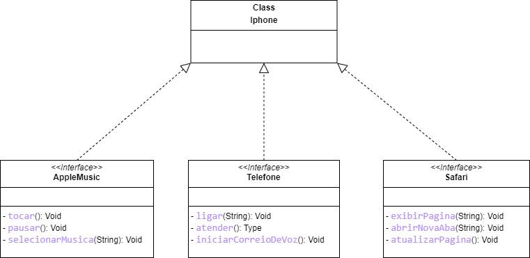

# Modelo de UML do Iphone, trazendo a abstração para o codigo em Java

Desafio feito para compreender o conteudo do módulo de POO e compreender o uso de UML.  
___
Segue imagem para a compreensão do desafio
___

